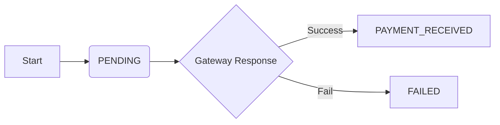
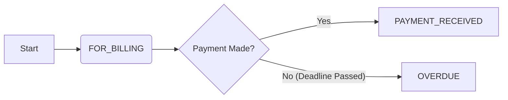
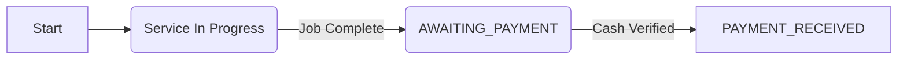

# Booking Payment Status Workflow Documentation

## 1. Overview
This document defines the technical workflow and business logic for handling booking payment statuses within the GetKlean Housemaid Application. It serves as a guide for developers, operations, and management to understand how payment states transition during the lifecycle of a service booking.

The system tracks the financial state of a booking using the `paymentStatus` lookup table.

## 2. Status Reference
The following status codes are the rigorous definitions used in the backend and database.

| Status Code | Display Name | Type | Definition |
| :--- | :--- | :--- | :--- |
| **PENDING** | Pending | `Pending` | The default initial state for immediate booking attempts where payment has not yet been confirmed (e.g., waiting for GCash/Card callback). |
| **FOR_BILLING** | For Billing | `Pending` | Indicates a booking that is active but unpaid, specifically waiting for an invoice to be generated or sent. Typical for B2B or credit-term clients. |
| **AWAITING_PAYMENT** | Awaiting Payment | `Pending` | Used for "Service-First" workflows. The service has been completed (Job Done), but the customer has not yet remitted payment (e.g., Cash on Delivery or Post-Service Bank Transfer). |
| **PAYMENT_RECEIVED** | Payment Received | `Success` | The final terminal state for a successful transaction. Funds have been verified and settled. |
| **FAILED** | Failed | `Failure` | The payment attempt was rejected by the gateway, bank, or system validation logic. |
| **OVERDUE** | Overdue | `Failure` | A time-based state where a `FOR_BILLING` or `AWAITING_PAYMENT` record has exceeded its defined payment terms without receipt. |

---

## 3. Payment Workflows (State Transitions)

The application supports three primary payment flows. The path a booking takes depends on the **Payment Method** and **Customer Type**.

### Flow A: Immediate Digital Payment
*Used for: Credit Card, GCash, Maya (Consumer Bookings)*

1.  **Initiation**: Customer creates a booking and selects "Pay Now".
    *   **State Set To**: `PENDING`
2.  **Processing**: App redirects to Payment Gateway.
3.  **Resolution**:
    *   **Success Callback**: Gateway returns 200 OK.
        *   **Action**: Update status to `PAYMENT_RECEIVED`.
        *   **Trigger**: Send Payment Confirmation Email.
    *   **Failure Callback**: Gateway returns error or user cancels.
        *   **Action**: Update status to `FAILED`.
        *   **Trigger**: Prompt user to retry or change payment method.

### Flow B: Billing / Invoicing
*Used for: Corporate Clients, Partners, Credit Terms*

1.  **Initiation**: Booking is created by Admin or Corporate Account.
    *   **State Set To**: `FOR_BILLING`
2.  **Invoicing**: Admin generates/sends the invoice.
    *   **State Remains**: `FOR_BILLING` (or optionally `BILLED` if granularity is added later).
3.  **Payment Window**: System monitors the due date.
4.  **Resolution**:
    *   **Payment Verified**: Finance records the payment.
        *   **Action**: Manual/System update to `PAYMENT_RECEIVED`.
    *   **Time Expired**: Due date passes.
        *   **Action**: System Job updates status to `OVERDUE`.

### Flow C: Service-First (Post-Payment)
*Used for: Cash on Delivery (COD), Direct Bank Transfer after Service*

1.  **Initiation**: Booking confirmed with "Pay Later" option.
    *   **State Set To**: `PENDING` (Initial) or directly handled via Booking Status.
2.  **Service Execution**: Housemaid performs the cleaning service.
3.  **Completion**: Housemaid marks booking as "Completed".
    *   **Action**: System automatically transitions payment status to `AWAITING_PAYMENT`.
4.  **Collection**:
    *   **Cash Collected**: Housemaid confirms receipt.
        *   **Action**: Update to `PAYMENT_RECEIVED`.
    *   **No Payment**: Customer fails to pay on site.
        *   **Action**: Flag for Admin review -> `OVERDUE` or `FAILED`.

---

## 4. Operational Handling

### Handling `FAILED` Transactions
*   **Trigger**: Webhook failure, insufficient funds, or system timeout.
*   **System Behavior**: The booking may be auto-cancelled if payment is required for confirmation.
*   **Admin Action**: Check logs for failure reason. Contact customer to retry payment.

### Handling `OVERDUE` Accounts
*   **Trigger**: Nightly cron job checking `FOR_BILLING` records against `due_date`.
*   **System Behavior**: Block future bookings for this customer.
*   **Admin Action**: Collections process.

## 5. Summary of Roles

*   **System / Gateway**: Handles automated transitions for `PENDING` -> `PAYMENT_RECEIVED` / `FAILED`.
*   **Housemaid App**: Triggers transition to `AWAITING_PAYMENT` upon job completion. Verifies Cash payments.
*   **Finance/Admin**: Manages `FOR_BILLING` accounts and resolves `OVERDUE` or `FAILED` states manually if needed.
